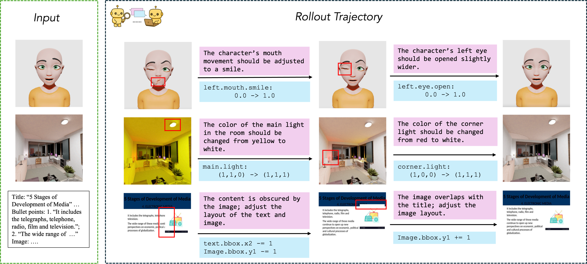

## 👷 ⚠️ WARNING ⚠️ 👷

### 🚧 Work In Progress 🚧

**This project is currently under active development.**
**Unit tests are being implemented, and the build may be unstable.**
**Please check back later for the v0 release.**

<h1 align="center">VIGA: Vision-as-Inverse-Graphics Agent via Interleaved Multimodal Reasoning</h1>

    
    
    
    

 

# About

VIGA is an analysis-by-synthesis code agent for programmatic visual reconstruction. It approaches vision-as-inverse-graphics through an iterative loop of generating, rendering, and verifying scenes against target images.

A single self-reflective agent alternates between two roles:

- **Generator** — Writes and executes scene programs using tools for planning, code execution, asset retrieval, and scene queries.

- **Verifier** — Examines rendered output from multiple viewpoints, identifies visual discrepancies, and provides feedback for the next iteration.

The agent maintains an evolving contextual memory with plans, code diffs, and render history. This write-run-compare-revise loop is self-correcting and requires no finetuning.

    

