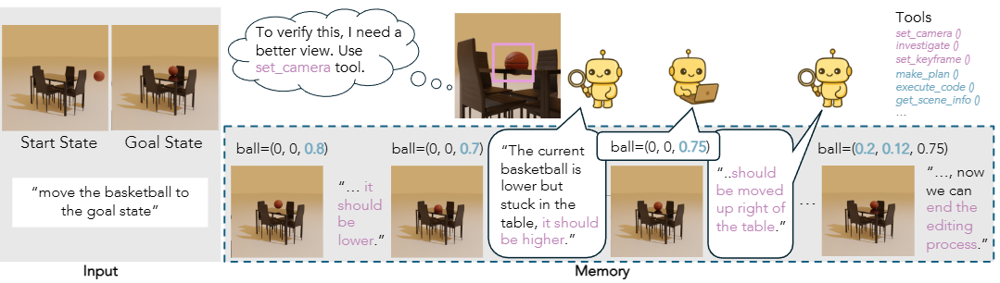

# VIGA: Vision-as-Inverse-Graphics Agent

<p align="center">
  <a href="https://viga-agent.github.io/"></a>
  <a href="https://arxiv.org/abs/XXX"></a>
  <a href="https://huggingface.co/XXX"></a>
</p>

## Introduction

VIGA is an **analysis-by-synthesis** code agent for programmatic visual reconstruction. It approaches vision-as-inverse-graphics through an iterative loop of generating, rendering, and verifying scenes against target images.

<p align="center">
  
</p>

A single self-reflective agent alternates between two roles:

- **Generator**: Writes and executes scene programs using tools for planning, code execution, asset retrieval, and scene queries.

- **Verifier**: Examines rendered output from multiple viewpoints, identifies visual discrepancies, and provides feedback for the next iteration.

The agent maintains an **evolving contextual memory** with plans, code diffs, and render history. This write → run → compare → revise loop is **self-correcting and requires no finetuning**, enabling the same protocol to run across different foundation VLMs.

## Supported Domains

VIGA naturally generalizes across 2D, 3D, and 4D visual tasks through its analysis-by-synthesis loop:

| Mode | Description | Output |
|------|-------------|--------|
| **BlenderGym** | Single-step 3D graphics editing | Blender Python code |
| **BlenderStudio** | Multi-step 3D graphics editing (Level 1-3) | Blender Python code |
| **Static Scene** | Single-view 3D scene reconstruction from scratch | Blender scene (.blend) |
| **Dynamic Scene** | 4D dynamic scene reconstruction with physics | Blender animation |
| **AutoPresent** | 2D programmatic slide/document layout synthesis | PowerPoint (PPTX) |
| **Design2Code** | 2D layout synthesis from design images | HTML/CSS files |

## Installation

### Prerequisites

- Docker (version 20.10+)
- NVIDIA GPU with CUDA 12.8+ support
- NVIDIA Container Toolkit

### Docker Setup (Recommended)

#### For Users: Pull and Run the Docker Image

1. **Install Docker and NVIDIA Container Toolkit**:

```bash
# Install Docker
curl -fsSL https://get.docker.com -o get-docker.sh
sudo sh get-docker.sh

# Install NVIDIA Container Toolkit
distribution=$(. /etc/os-release;echo $ID$VERSION_ID)
curl -s -L https://nvidia.github.io/nvidia-docker/gpgkey | sudo apt-key add -
curl -s -L https://nvidia.github.io/nvidia-docker/$distribution/nvidia-docker.list | \
  sudo tee /etc/apt/sources.list.d/nvidia-docker.list
sudo apt-get update && sudo apt-get install -y nvidia-container-toolkit
sudo systemctl restart docker
```

2. **Pull the VIGA Docker image**:

```bash
docker pull <your-dockerhub-username>/viga:latest
```

3. **Run the Docker container**:

```bash
docker run --gpus all -it \
  -v $(pwd)/data:/workspace/data \
  -v $(pwd)/output:/workspace/output \
  -v $(pwd)/utils:/workspace/utils \
  <your-dockerhub-username>/viga:latest
```

This mounts your local `data`, `output`, and `utils` directories into the container.

#### For Developers: Build and Push the Docker Image

1. **Build the Docker image**:

```bash
# Create Dockerfile (see docs/DOCKER.md for complete configuration)
docker build -t viga:latest .
```

2. **Tag and push to Docker Hub**:

```bash
docker tag viga:latest <your-dockerhub-username>/viga:latest
docker login
docker push <your-dockerhub-username>/viga:latest
```

3. **Build multi-architecture images** (optional):

```bash
docker buildx create --use
docker buildx build --platform linux/amd64,linux/arm64 \
  -t <your-dockerhub-username>/viga:latest --push .
```

See [docs/DOCKER.md](docs/DOCKER.md) for complete Dockerfile configuration and build instructions.

### Configuration

Create configuration files in `utils/`:

**`utils/_api_keys.py`**:
```python
OPENAI_API_KEY = "your-openai-api-key"
OPENAI_BASE_URL = "https://api.openai.com/v1"
CLAUDE_API_KEY = "your-claude-api-key"
CLAUDE_BASE_URL = "https://api.anthropic.com/v1"
GEMINI_API_KEY = "your-gemini-api-key"
MESHY_API_KEY = "your-meshy-api-key"  # For 3D asset generation
```

**`utils/_path.py`**:
```python
# Configure paths for different tool environments
path_to_cmd = {
    "tools/blender/exec.py": "/path/to/blender/env/bin/python",
    "tools/slides/exec.py": "/path/to/pptx/env/bin/python",
    "tools/exec_html.py": "/path/to/web/env/bin/python",
    # Add other tool paths as needed
}
```

### Alternative: Conda Installation

If you prefer to set up environments using Conda instead of Docker, please refer to [docs/CONDA_SETUP.md](docs/CONDA_SETUP.md) for detailed instructions.

## Quick Start

### Demo: BlenderGym

Run a single BlenderGym task:

```bash
conda activate agent
python main.py \
    --mode blendergym \
    --model gpt-4o \
    --target-image-path data/blendergym/placement/1/target.png \
    --init-code-path data/blendergym/placement/1/code.py \
    --blender-file data/blendergym/placement/1/scene.blend \
    --max-rounds 10
```

### Demo: Static Scene Reconstruction

Reconstruct a 3D scene from a single image:

```bash
conda activate agent
python main.py \
    --mode static_scene \
    --model gpt-4o \
    --target-image-path data/static_scene/kitchen/reference.jpg \
    --max-rounds 100
```

### Demo: AutoPresent

Generate a PowerPoint presentation:

```bash
conda activate agent
python main.py \
    --mode autopresent \
    --model gpt-4o \
    --target-image-path data/autopresent/examples/business/1/target.png \
    --max-rounds 10
```

## Batch Execution

For batch processing of datasets, use the runners:

```bash
# BlenderGym
python runners/blendergym.py --dataset-path data/blendergym --task all --model gpt-4o

# BlenderStudio
python runners/blenderstudio.py --dataset-path data/blenderstudio --task all --model gpt-4o

# Static Scene
python runners/static_scene.py --dataset-path data/static_scene --task all --model gpt-4o

# AutoPresent
python runners/autopresent.py --dataset-path data/autopresent/examples --task all --model gpt-4o
```

See [docs/RUNNERS.md](docs/RUNNERS.md) for detailed runner documentation.

## Documentation

- [Architecture](docs/ARCHITECTURE.md) - System design and skill library
- [Docker Setup](docs/DOCKER.md) - Complete Docker configuration guide
- [Conda Setup](docs/CONDA_SETUP.md) - Alternative Conda installation guide
- [Runners](docs/RUNNERS.md) - Batch execution and command-line options
- [Evaluation](docs/EVALUATION.md) - Metrics and benchmarks

## License

MIT License

## Citation

If you use VIGA in your research, please cite:

```bibtex
@inproceedings{viga2025,
  title     = {Vision-as-Inverse-Graphics as a VLM Coding Agent},
  booktitle = {Proceedings of the IEEE/CVF Conference on Computer Vision and Pattern Recognition (CVPR)},
  year      = {2025}
}
```
